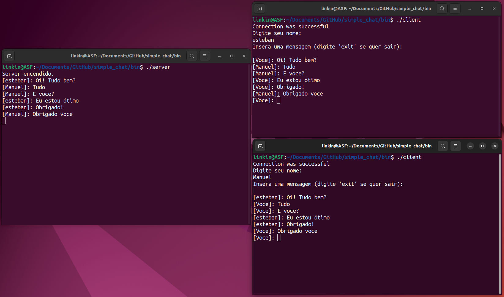

# COMO COMPILAR

- Ter instalado CMAKE: https://cmake.org/download/
- Abrir um console.
- Localizar a rota do projeto e accesar a pasta "simple_chat" desde o console.
- Criar uma nova pasta chamada: "build".
- Accesar a essa pasta nova pasta.
- Executar o comando:
```
cmake ..
```
- Depois, executar o seguinte comando na mesma pasta:
```
make
```
- Feito isso, tudo seria compilado.

# COMO RODAR

- Ter pelo menos três terminais abertos.
- Na pasta do projecto "simple_chat", accesar a pasta bin que é criada depois de compilar o projeto.
- Rodar em um só console o executável (**Importante:** Este é o primer executável que se tem que rodar):
```
./server
```
- Rodar no resto de consoles:
```
./client
```
- O chat é só entre os clientes, se quiser sair de algum cliente, tem que escrever a palavra: "exit".

- Se quiser sair do server tem que usar a combinação de teclas: "Ctrl+C" o a combinação que cumpla com a mesma função no seu SO.

# Exemplo

